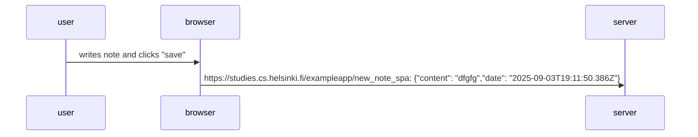
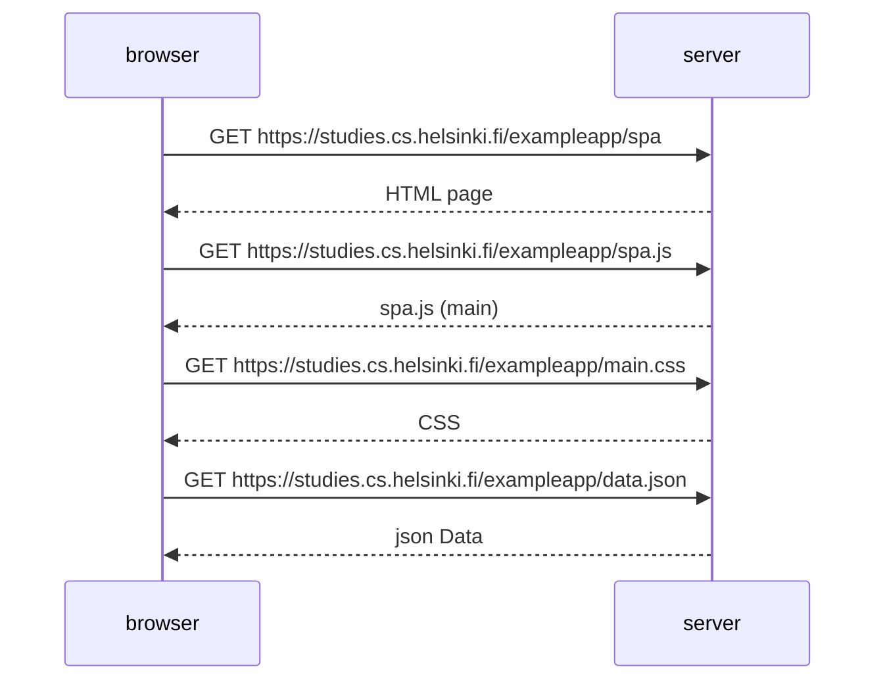

# contains mermaid diagrams for 0.4, 0.5, and 0.6


## 0.4



## 0.5



## 0.6
```mermaid
sequenceDiagram
    participant user
    participant browser
    participant server

    user->>browser: writes note and clicks "save"
    browser->>server: Post https://studies.cs.helsinki.fi/exampleapp/new_note_spa
    server-->>browser: Created
    browser->>browser: update the notes list
